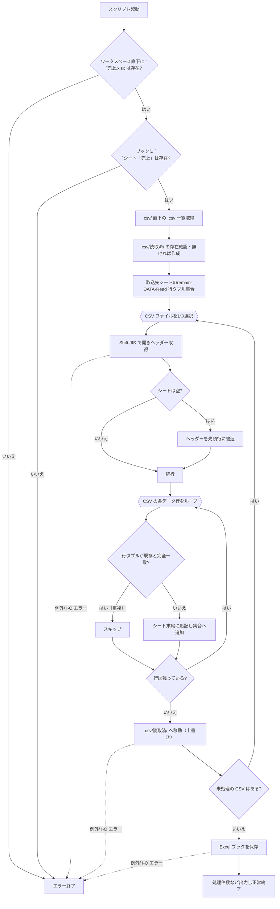

# CSV 売上取込スクリプト仕様

## Notes

- ワークスペース直下に `売上.xlsx` が存在し、かつ同ブックに `売上` シートが存在することを前提とする。存在しない場合は処理を中止し、エラーを返す
- 取込対象 CSV は `csv/` 直下にある拡張子 `.csv` のファイルすべて（サブフォルダは対象外）
- CSV は Shift-JIS エンコーディング
- CSV の 1 行目はヘッダー（全ファイル同一構成）
- 取込先シートが空の場合、先頭にヘッダー行を書き込む
- 取込時はシート末尾に追記する
- 取込前にシート全体を読込み、各行を「全列値の完全一致」で比較し、重複行をスキップする
- 取込後、処理済み CSV は `csv/読取済/` に移動（フォルダが無ければ作成）し、同名ファイルがあれば上書き
- 処理中に発生した例外・I/O エラーは呼び出し元へ送出するか、明示的にログ出力して終了する

# Tasks

- [ ] 1.0 スクリプト起動時にワークスペース直下の `売上.xlsx` の存在を確認
  - [ ] 1.1 同ブック内に `売上` シートが存在するか確認
- [ ] 2.0 エラー条件検査
  - [ ] 2.1 ファイルまたはシートが無ければエラーメッセージを出して終了
- [ ] 3.0 `csv/` 直下の `.csv` ファイル一覧を取得
- [ ] 4.0 `csv/読取済/` フォルダの存在をチェックし、無ければ作成
- [ ] 5.0 取込先シートの既存データをすべて読み込み、行をタプル等で保持
- [ ] 6.0 CSV ファイルを 1 つずつ処理
  - [ ] 6.1 Shift-JIS で読込み、ヘッダー行を取得
  - [ ] 6.2 シートが空であればヘッダーを先頭行に書込む（列順そのまま）
  - [ ] 6.3 データ行をループ
    - [ ] 6.3.1 行タプルを既存データと比較し、重複ならスキップ
    - [ ] 6.3.2 重複でなければシート末尾に追記
  - [ ] 6.4 CSV ファイルを `csv/読取済/` へ移動（同名があれば上書き）
- [ ] 7.0 すべての CSV が完了したら Excel ブックを保存
- [ ] 8.0 正常終了メッセージまたは処理件数などを出力

